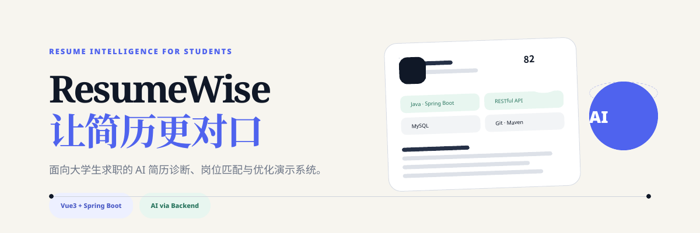
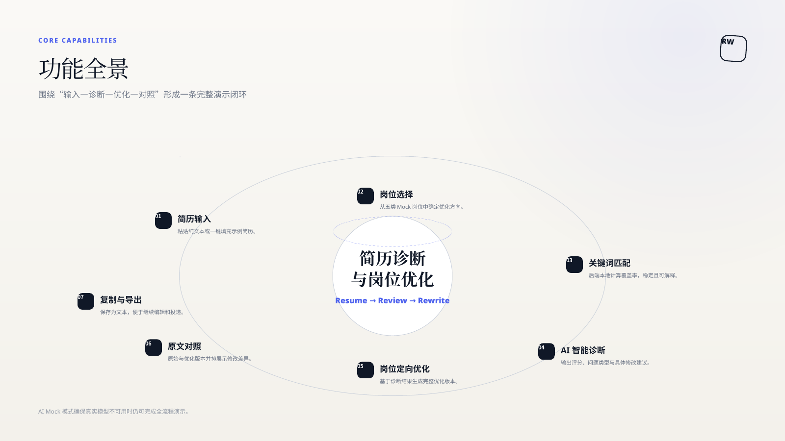
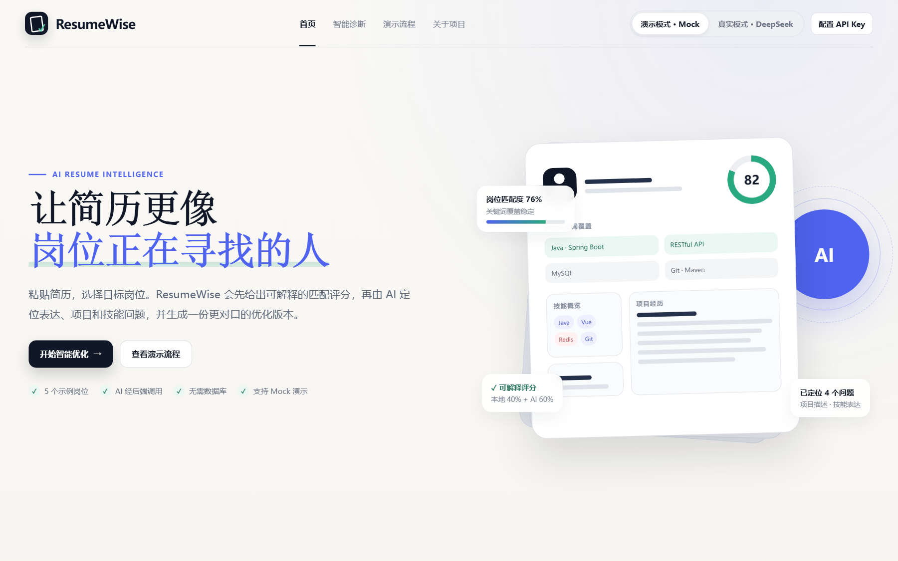
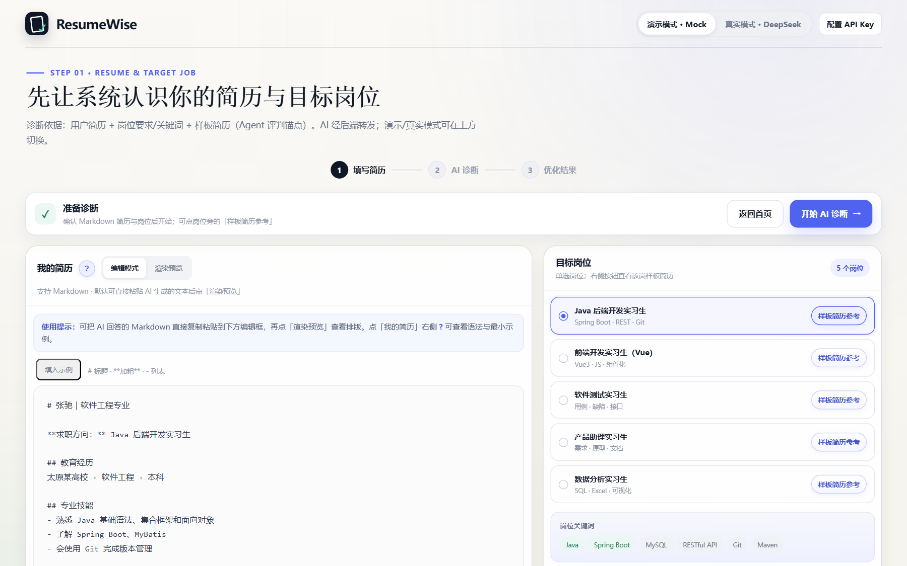
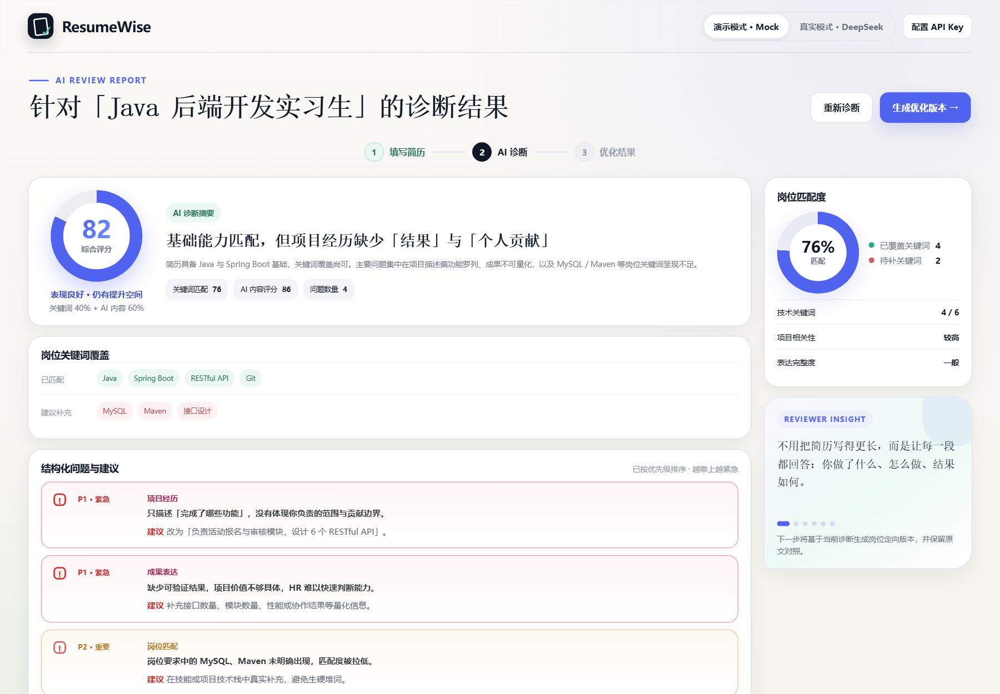
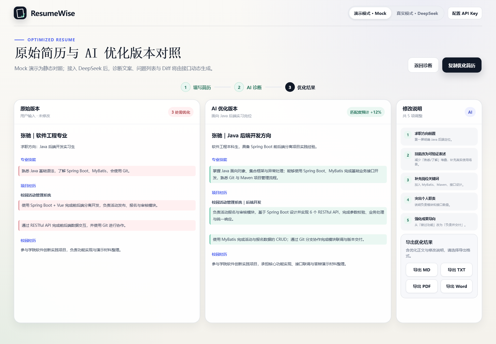
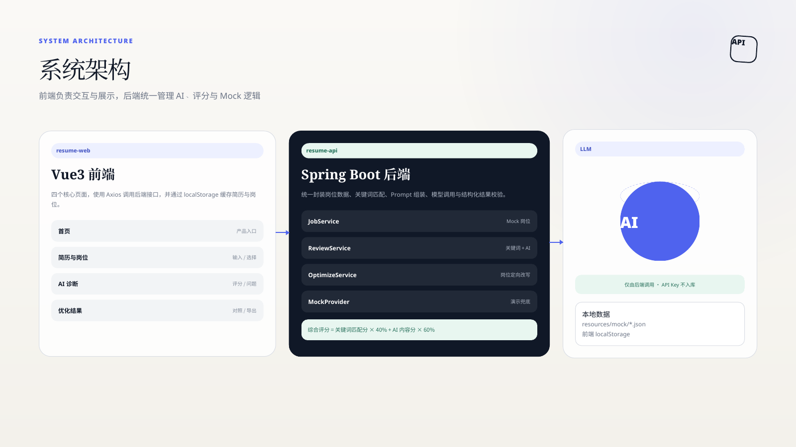
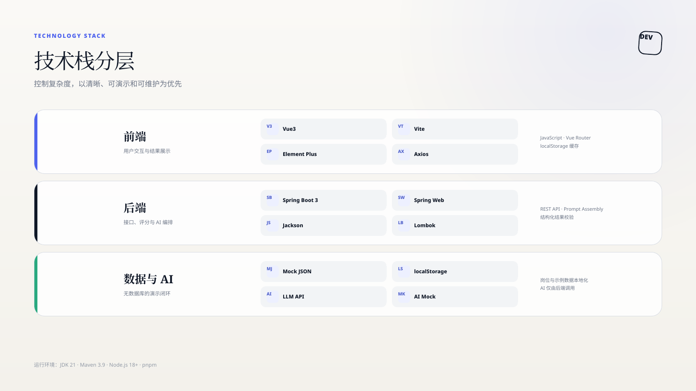
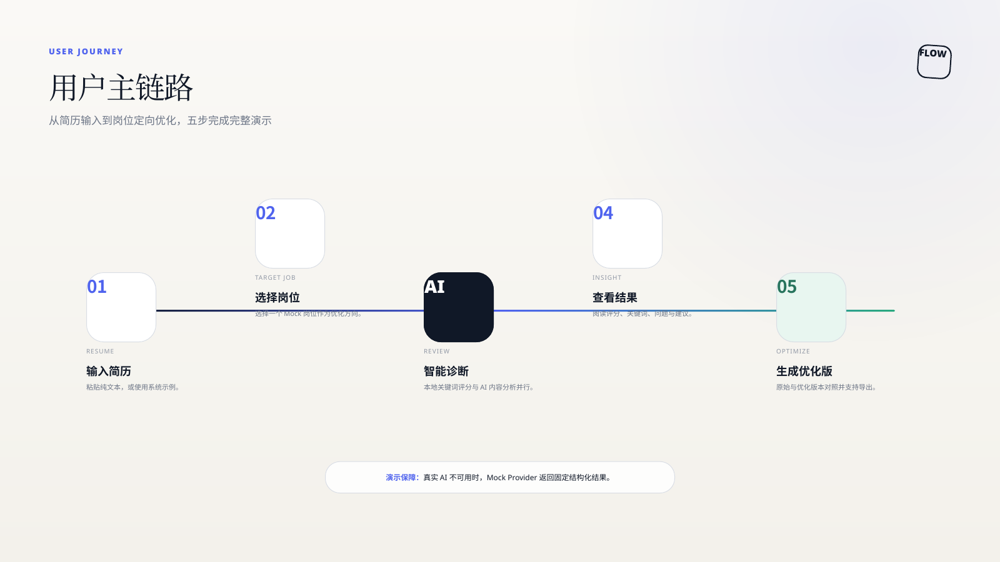
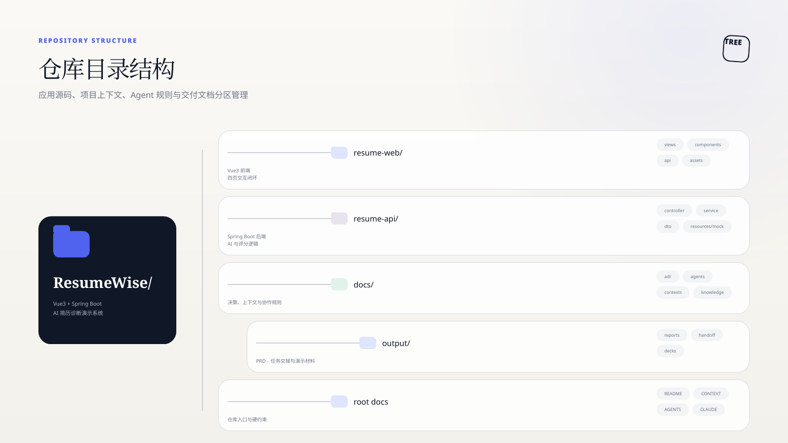

<div align="center">

# ResumeWise · AI 简历诊断与优化系统

*输入简历，选定岗位，AI 帮你看清问题，再给一份更对口的版本。*

🎓 面向大学生求职场景的 AI 简历诊断、岗位匹配与优化**演示系统**（大二小学期项目）。  
不是招聘平台——只做一条闭环：**简历 → 目标岗位 → AI 诊断 → 展示问题 → 生成优化版本**。

</div>

<p align="center">
  
</p>

<p align="center">
  
  
  
  
  
</p>

<p align="center">
  <a href="#为什么做这个">💡 为什么</a> ·
  <a href="#功能">✨ 功能</a> ·
  <a href="#演示">📱 演示</a> ·
  <a href="#快速开始">🚀 快速开始</a> ·
  <a href="#使用说明与答辩稿">📘 使用说明</a> ·
  <a href="#架构">🏗️ 架构</a> ·
  <a href="#路线图">🗺️ 路线图</a> ·
  <a href="#文档">📚 文档</a>
</p>

---

## 为什么做这个

大学生写简历投实习，常见三类问题：

- **不知道差在哪**：项目描述空洞、技能堆砌、表达偏笼统；
- **不知道岗位要什么**：简历和 JD 关键词对不上；
- **不知道怎么改**：诊断了一堆问题，却没有「改完应该长什么样」的对照。

ResumeWise 把链路做成可演示闭环：Mock 岗位 + 样板简历参照 +（Mock / DeepSeek 真实）诊断与优化，左右对照导出。

| 能力 | 产品职责 |
|---|---|
| 简历输入 | Markdown 编辑 / 预览，示例填充，localStorage 缓存 |
| 岗位 + 样板 | 5 个 Mock 岗位；每岗样板简历弹窗浏览 |
| AI 诊断 | 综合评分、匹配度、关键词、结构化问题（按优先级） |
| AI 优化 | 岗位定向优化版 + 修改说明 + 多格式导出 |
| 双模式 | **演示 Mock** / **真实 DeepSeek V4**（Flash / Pro） |

> **边界：** 不做文件解析（Word/PDF 上传解析）、招聘爬虫、登录注册、企业端、数据库、多轮聊天 Agent、自动投递。

---

## 功能

<p align="center">
  
</p>

| 功能 | 说明 |
|---|---|
| **Markdown 简历** | 编辑模式 + 渲染预览；语法帮助（?） |
| **岗位选择** | Java / 前端 / 测试 / 产品 / 数据 5 个 Mock 岗 |
| **样板简历参考** | 岗位卡片旁打开弹窗，多份样板 MD 渲染浏览 |
| **评分可解释** | 关键词匹配 × 40% + AI 内容 × 60%（ADR-0001） |
| **结构化问题** | 按 P1/P2/P3 优先级展示 + 建议 |
| **对照与导出** | 原始 ↔ 优化；MD / TXT / PDF / Word |
| **演示模式** | 无 Key 也能完整走通 Mock 链路 |
| **真实模式** | DeepSeek V4 Flash / Pro；Key 存本机 localStorage |

---

## 演示

### 推荐路径

```
开始智能优化 → 编辑/粘贴 Markdown 简历 → 选岗位（可看样板）
  → 开始 AI 诊断 → 查看评分/关键词/问题
  → 生成优化版本 → 对照 → 导出
```

真实模式额外：顶栏切到 **真实模式 · DeepSeek** → 配置 API Key → 启动本机代理（见下）。

### Showcase

| 首页 | 填写简历 |
|:---:|:---:|
|  |  |

| AI 诊断 | 优化结果 |
|:---:|:---:|
|  |  |

---

## 快速开始

### 前端源码（`resume-web/src` · 当前可演示）

```text
resume-web/src/     ← 规范 SRC：HTML/CSS/JS 静态原型源码
```

```bash
# 终端 1：前端
cd resume-web
npm run dev
# → http://127.0.0.1:5177

# 或：cd resume-web/src && python -m http.server 5177
```

**真实模式 DeepSeek（可选）：**

```bash
# 终端 2：CORS 代理（勿关）
cd resume-web
npm run proxy
# → http://127.0.0.1:8787
```

1. 顶栏切到 **真实模式 · DeepSeek**  
2. **配置 API Key**（仅本机 localStorage，不入库）  
3. 模型选 **DeepSeek V4 Flash** 或 **V4 Pro**  
4. 填写简历 → 开始 AI 诊断（结果由模型动态生成）

### 使用说明与答辩稿

面向使用方 / 助教 / 答辩的完整文档包：

| 文档 | 路径 |
|---|---|
| **项目使用与运行说明** | [`docs/output/reports/client-deliverables/使用与运行说明.md`](docs/output/reports/client-deliverables/使用与运行说明.md) |
| **演示答辩逐字稿** | [`docs/output/reports/client-deliverables/演示答辩逐字稿.md`](docs/output/reports/client-deliverables/演示答辩逐字稿.md) |
| 索引 | [`docs/output/reports/client-deliverables/README.md`](docs/output/reports/client-deliverables/README.md) |

产品内也可查看：首页「使用教程」· **关于项目**（双模式与维护说明）。

### 业务后端（规划中）

> `resume-api/` 待业务 PRD 批准后脚手架（Spring Boot）。前端将由本 `resume-web` 演进为 Vue3。

| 组件 | 版本 |
|---|---|
| Node.js | 18+（前端 / 静态服务） |
| JDK | 21（后端规划） |
| Maven | 3.9（后端规划） |

<details>
<summary>新成员阅读顺序</summary>

| 顺序 | 路径 | 目的 |
|---|---|---|
| 1 | `README.md` | 定位、跑起来 |
| 2 | `CONTEXT.md` · `CONTEXT-MAP.md` | 术语与两端 |
| 3 | `AGENTS.md` · `CLAUDE.md` | 任务流 |
| 4 | `docs/adr/` | 评分 / Mock / AI 经后端 |
| 5 | `docs/output/reports/ui-prototype/html-src/` | 静态原型标杆 |

</details>

---

## 架构

<p align="center">
  
</p>

```text
resume-web/src（当前前端源码）
        │
        ├─ 演示模式 ──► 本地 Mock 结构化结果
        │
        └─ 真实模式 ──► 本机代理 :8787 ──► DeepSeek API
                              （正式版将改为 Spring Boot 持 Key）
```

<p align="center">
  
</p>

| 层 | 技术 |
|---|---|
| 前端源码 | `resume-web/src` · HTML / CSS / JS · Markdown · localStorage |
| 真实 AI | DeepSeek V4 Flash / Pro · `resume-web/src/deepseek-proxy.py` |
| 演进方向 | Vue3 · Vite · Element Plus · Axios（同目录升级） |
| 规划后端 | Spring Boot 3 · REST · 无数据库（`resume-api/`） |
| 数据 | Mock JSON + localStorage |

**硬约束（ADR）：** AI 生产环境经后端调用；Key 永不入库；评分 = 本地关键词 40% + AI 内容 60%；必须支持 Mock。

---

## 演示流程

<p align="center">
  
</p>

1. **输入简历**（Markdown）  
2. **选择目标岗位** + 可选样板参照  
3. **AI 诊断** → 评分 / 关键词 / 问题  
4. **优化对照** → 导出  

---

## 仓库结构

<p align="center">
  
</p>

```text
ResumeWise/
├── README.md · CONTEXT.md · AGENTS.md · CLAUDE.md
├── resume-web/                 # ★ 前端工程
│   ├── package.json
│   └── src/                    # ★ 规范 SRC 源码
│       ├── index.html · optimize.html · review.html · result.html
│       ├── assets/css · assets/js
│       └── deepseek-proxy.py
├── resume-api/                 # 后端（规划中）
└── docs/                       # 规范、ADR、配图、PRD/handoff
```

---

## 路线图

| 阶段 | 状态 |
|---|---|
| 资产与规范初始化 | ✅ |
| 静态高保真原型（GPT 标杆 + 交互） | ✅ |
| Mock / DeepSeek 双模式（原型） | ✅ |
| Vue3 + Spring Boot 业务复刻 | 待 PRD |
| 生产：Key 仅后端、部署 Vercel + API | 待实施 |

---

## 文档

| 文档 | 说明 |
|---|---|
| [`CONTEXT.md`](CONTEXT.md) | 产品域与术语 |
| [`resume-web/src/`](resume-web/src/) | **前端源码（SRC）** 与 DESIGN_SPEC |
| [`docs/output/reports/model-resumes/`](docs/output/reports/model-resumes/) | 样板简历调研 brief / QA |
| [`docs/adr/`](docs/adr/) | 架构决策 |
| [`AGENTS.md`](AGENTS.md) | 任务流与交付 |

---

## 许可与说明

大二小学期课程演示项目 · 非商业招聘平台。  
API Key 仅存各人浏览器 localStorage，clone 仓库不会带走他人的 Key。
